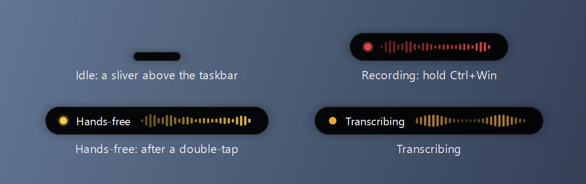

# Shout

**Private push-to-talk dictation for Windows.** Hold <kbd>Ctrl</kbd>+<kbd>Win</kbd>, say something, let go, and the text appears wherever your cursor is, in any app. Speech recognition runs on your own NVIDIA GPU with OpenAI's Whisper model. Nothing you say leaves your machine.



- **Fast.** Measured from letting go of the keys to text on screen: about 0.2 s for a sentence, 0.4 s for a long paragraph, and under a second for a full minute of speech (RTX 5070).
- **Private.** No cloud, no account, and no network at all once it's installed. Your words are never written to disk.
- **Works everywhere.** It pastes, so it works in any app that takes text, and it puts your clipboard back afterwards.
- **Hands-free when you want it.** Double-tap the keys and keep talking without holding anything.
- **Quiet.** A sliver of a pill above the taskbar shows what it's doing, and short audio cues confirm start and stop. You can design your own cues.

## Requirements

- **Windows 10 or 11.** Developed and tested on Windows 11.
- **An NVIDIA GPU**, GTX 16-series / RTX 20-series or newer, with a current driver. The model uses about 2.3 GB of VRAM while Shout runs. See [Known limitations](#known-limitations) for older cards and CPU-only machines.
- **[git](https://git-scm.com/) and [uv](https://docs.astral.sh/uv/)**. Install uv with `winget install --id=astral-sh.uv -e`. It fetches the right Python version by itself.
- **About 4 GB of disk.** The Python environment is 2.5 GB (mostly NVIDIA's CUDA libraries) and the model is 1.6 GB.

## Install

```powershell
git clone https://github.com/Bandai-Boy/Shout.git
cd Shout
powershell -ExecutionPolicy Bypass -File scripts\install.ps1
```

That one script:

1. builds the Python environment from the lockfile;
2. downloads the model, which is the only time Shout ever uses the network;
3. checks that the model actually transcribes correctly on your GPU;
4. adds Shout to the Start menu.

Most of the few minutes it takes is the download.

To have Shout start with Windows, add `-Autostart` to the last line. Re-running the script is safe, and it's also the fix if you move the folder.

## Use

Start **Shout** from the Start menu. A tray icon appears, and a pill sits above the taskbar. The pill shows *Starting* until the model is loaded, which takes a few seconds.

| To | Do this |
|---|---|
| Dictate | Hold **Ctrl+Win**, speak, and release. The text is pasted where your cursor is. |
| Dictate hands-free | **Double-tap Ctrl+Win**. The pill turns amber and says *Hands-free*. Tap **Ctrl+Win** once to finish. |
| Cancel | While holding Ctrl+Win, press any other key. The recording is thrown away, and Windows still gets its shortcut, so Ctrl+Win+D and the rest keep working. |
| Get back a dictation that didn't paste | **Left-click the tray icon** to copy your last dictation, then click where it goes and press Ctrl+V. For older ones, right-click the tray icon and choose **Recent dictations...** |
| Change the sounds | Right-click the tray icon and choose **Cue sounds...** |
| Quit | Right-click the tray icon and choose **Quit Shout**. |

A recording finishes and transcribes on its own after 2 minutes of holding, or 10 minutes hands-free.

## Settings

Settings live in `%APPDATA%\Shout\config.json`. The **Cue sounds** page creates the file the first time you save a sound; otherwise, create it yourself. Any key you leave out keeps its default. Quit and restart Shout after editing. Sounds saved on the Cue sounds page are the exception: they apply from the next dictation.

| Key | Default | What it does |
|---|---|---|
| `language` | `"en"` | The language you speak, as a code like `"de"`, or `null` to detect it each time. |
| `model` | `"large-v3-turbo"` | Any [faster-whisper](https://github.com/SYSTRAN/faster-whisper) model name. Run `.venv\Scripts\python.exe scripts\download_model.py` after changing it. |
| `compute_type` | `"float16"` | `"int8"` uses less VRAM. |
| `input_device`, `output_device` | `null` | `null` follows the Windows default microphone and speakers, and keeps following them when you switch. |
| `preroll_ms` | `0` | Keeps the microphone open with a rolling buffer of this many milliseconds, so a word spoken the instant you press isn't clipped. Windows then shows the microphone as always in use. |
| `restore_clipboard` | `true` | Puts your previous clipboard back after pasting. |
| `cues`, `cue_volume` | `true`, `0.25` | Audio cues on or off, and how loud they are. |
| `overlay` | `true` | Shows the pill. |
| `ptt_ceiling_s`, `latch_ceiling_s` | `120`, `600` | The automatic stop limits, in seconds. |
| `tap_max_ms`, `latch_window_ms` | `300`, `350` | How short a press counts as a tap, and how quickly the second tap of a double-tap must follow. |

## Privacy: what Shout touches

Shout needs a keyboard hook, your microphone and your clipboard. That's exactly the kind of software you should be suspicious of, so here is all of it:

| | |
|---|---|
| **Keyboard** | A low-level hook that watches for Ctrl+Win. It never blocks a key, and it remembers nothing except which keys are held down right now. |
| **Microphone** | Opened when you press Ctrl+Win and closed when you finish (unless you set `preroll_ms`). Audio stays in memory and is discarded after transcription. It is never written to disk. |
| **Clipboard** | Text is pasted via the clipboard and marked private, so it stays out of Windows Clipboard History and cloud clipboard sync. Your previous clipboard is put back, with its own privacy intact. Copying a dictation back from the tray icon or the recent list marks it private too. |
| **Recent dictations** | Your last 10 dictations are kept in memory, so you can copy one back if a paste missed. They are never written to disk and are forgotten when Shout quits. **Clear** on the Recent dictations page forgets them sooner. |
| **Keystrokes** | One synthetic Ctrl+V per dictation, sent only after you've let go of Ctrl+Win. |
| **Network** | None while running. Shout loads the model with `HF_HUB_OFFLINE=1` and `local_files_only=True`, and the installer's model download is the only network access. To check for yourself, `git grep -n -E "(import\|from) (requests\|urllib\|http\|socket\|httpx)" -- shout/` finds nothing. |
| **Disk** | `%APPDATA%\Shout\config.json`, plus `shout.log`, which records timings, character counts and device names but never your words. |
| **Startup** | Only if you installed with `-Autostart`. |

## Known limitations

- **Windows and NVIDIA only, tested on one machine** (Windows 11, RTX 5070). faster-whisper can run on a CPU (`"device": "cpu"` with `"compute_type": "int8"`), and CTranslate2 supports int8 on GTX 10-series cards. Neither is tested here, and CPU will be much slower.
- **Admin windows**, meaning anything running elevated such as Task Manager or an admin terminal, can't receive a paste from a normal app. Shout leaves the text on your clipboard and tells you.
- **The clipboard restore is text-only.** If you had an image or files copied, your transcript replaces them.
- **The pill hides while a fullscreen game or app is running**, except while you're dictating.

## Meeting transcription

`scripts/transcribe_meeting.py` transcribes a recording with the same local model, for meetings you'd rather not upload anywhere. It needs [ffmpeg](https://ffmpeg.org/) on your PATH, and it writes plain and timestamped transcripts to `transcripts/`.

```powershell
.venv\Scripts\python.exe scripts\transcribe_meeting.py path\to\recording.m4a
```

## Uninstall

1. Right-click the tray icon and choose **Quit Shout**.
2. Delete `Shout.lnk` from `%APPDATA%\Microsoft\Windows\Start Menu\Programs`, and from its `Startup` folder if you used `-Autostart`.
3. Delete the Shout folder and `%APPDATA%\Shout`.
4. Delete the model from `%USERPROFILE%\.cache\huggingface\hub\models--mobiuslabsgmbh--faster-whisper-large-v3-turbo`.

## How it's built

- **Speech recognition:** [faster-whisper](https://github.com/SYSTRAN/faster-whisper) (CTranslate2) runs Whisper large-v3-turbo on the GPU in float16. The model stays loaded, and a warm-up transcription at launch pays CUDA's one-time startup cost before you need it.
- **CUDA:** it comes from NVIDIA's pip wheels (cuBLAS, cuDNN), so there's no CUDA Toolkit to install.
- **Hotkey:** a low-level keyboard hook ([pynput](https://github.com/moses-palmer/pynput)), because Windows' `RegisterHotKey` can't bind a modifier-only chord.
- **Interface:** [Qt](https://doc.qt.io/qtforpython-6/) draws the pill and the tray icon.

[RESEARCH.html](https://bandai-boy.github.io/Shout/RESEARCH.html) has the benchmarks, the options that were ruled out and why, and an audit of claims made elsewhere. [CLAUDE.md](CLAUDE.md) is the project's engineering log. Shout was built with [Claude Code](https://claude.com/claude-code), and that file records what each session learned, bugs included.

## Development

```powershell
uv sync                                     # the environment, plus dev tools
git config core.hooksPath hooks             # turn on the commit guard (the repo gate checks it)
.venv\Scripts\python.exe -m shout           # run from a terminal; it logs to the console too
.venv\Scripts\python.exe harness\gates.py   # the full test suite
```

**Quit Shout before running the gates.** They send a real Ctrl+Win, and a running Shout would take that as dictation.

**Run them from an ordinary terminal.** Several gates need the foreground rights Windows gives a program started from the active window.

**Expect them to take over briefly.** A test window opens and gets typed into, focus moves for a moment, test tones play, and your default speakers and microphone are switched for about 3 seconds and then put back.

The commit guard refuses to commit recordings, transcripts, or any file over 1 MB.

## License

[MIT](LICENSE). Shout is built on [faster-whisper](https://github.com/SYSTRAN/faster-whisper), [CTranslate2](https://github.com/OpenNMT/CTranslate2), OpenAI's [Whisper](https://github.com/openai/whisper) (the model is MIT-licensed), [PySide6](https://doc.qt.io/qtforpython-6/) (LGPL), [pynput](https://github.com/moses-palmer/pynput) (LGPL) and [sounddevice](https://github.com/spatialaudio/python-sounddevice).

`audio/jfk.wav` is a public-domain clip of President Kennedy's inaugural address, used as the reference sample.
